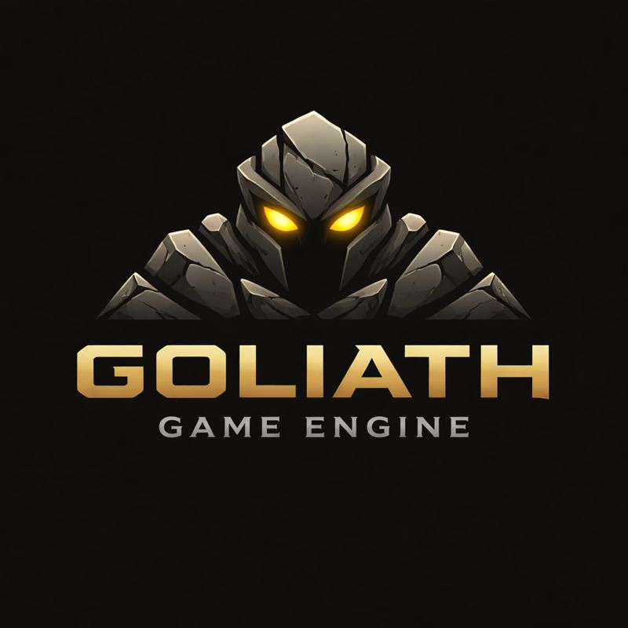

# Goliath Game Engine



Goliath is a high-performance, cross-platform game engine designed for professional developers.

## About

The Goliath Game Engine provides a comprehensive suite of tools and libraries to create stunning interactive experiences. From 2D mobile games to complex 3D simulations, Goliath is engineered for flexibility and performance.

## Features

*   **Cross-Platform:** Build for macOS, Windows, Linux, iOS, and Android from a single codebase. (Note: Currently, only macOS is implemented).
*   **High-Performance Rendering:** A modern rendering pipeline built on top of Metal, Vulkan, and DirectX.
*   **Extensible Architecture:** A modular design that allows for easy integration of new features and custom plugins.
*   **Advanced Physics:** A robust physics engine for realistic simulations.

## Getting Started

### Prerequisites

*   macOS
*   Xcode Command Line Tools (for `clang`)

### Building the Engine

To build the engine, run the following command from the `code` directory:

```bash
./build.sh
```

### Running the Engine

After building the engine, you can run it with the following command from the `code` directory:

```bash
./run.sh
```

## Contributing

We welcome contributions to the Goliath Game Engine! Please see our contributing guidelines for more information.

## License

This project is licensed under the MIT License - see the [LICENSE.md](LICENSE.md) file for details.
